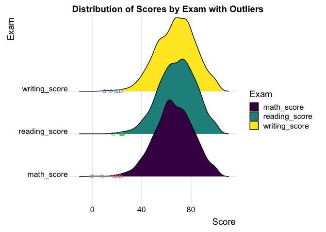

p8130_final_project
================
2023-11-28

``` r
score_df = 
  read_csv("./data/project_1_data.csv") |>
  janitor::clean_names()
```

    ## Rows: 948 Columns: 14
    ## ── Column specification ────────────────────────────────────────────────────────
    ## Delimiter: ","
    ## chr (10): Gender, EthnicGroup, ParentEduc, LunchType, TestPrep, ParentMarita...
    ## dbl  (4): NrSiblings, MathScore, ReadingScore, WritingScore
    ## 
    ## ℹ Use `spec()` to retrieve the full column specification for this data.
    ## ℹ Specify the column types or set `show_col_types = FALSE` to quiet this message.

``` r
proj1=score_df
proj1 %>%
tbl_summary(
  missing_text = "(Missing)", # counts missing values
  statistic = list(all_continuous() ~ "mean={mean} (min={min}, max={max}, sd={sd})",
                   all_categorical() ~ "n={n} (p={p}%)") # stats for categorical
 # specify variables to include
  ) %>%
bold_labels()  %>%
italicize_levels()
```

<div id="wqpqotcwbc" style="padding-left:0px;padding-right:0px;padding-top:10px;padding-bottom:10px;overflow-x:auto;overflow-y:auto;width:auto;height:auto;">
<style>#wqpqotcwbc table {
  font-family: system-ui, 'Segoe UI', Roboto, Helvetica, Arial, sans-serif, 'Apple Color Emoji', 'Segoe UI Emoji', 'Segoe UI Symbol', 'Noto Color Emoji';
  -webkit-font-smoothing: antialiased;
  -moz-osx-font-smoothing: grayscale;
}
&#10;#wqpqotcwbc thead, #wqpqotcwbc tbody, #wqpqotcwbc tfoot, #wqpqotcwbc tr, #wqpqotcwbc td, #wqpqotcwbc th {
  border-style: none;
}
&#10;#wqpqotcwbc p {
  margin: 0;
  padding: 0;
}
&#10;#wqpqotcwbc .gt_table {
  display: table;
  border-collapse: collapse;
  line-height: normal;
  margin-left: auto;
  margin-right: auto;
  color: #333333;
  font-size: 16px;
  font-weight: normal;
  font-style: normal;
  background-color: #FFFFFF;
  width: auto;
  border-top-style: solid;
  border-top-width: 2px;
  border-top-color: #A8A8A8;
  border-right-style: none;
  border-right-width: 2px;
  border-right-color: #D3D3D3;
  border-bottom-style: solid;
  border-bottom-width: 2px;
  border-bottom-color: #A8A8A8;
  border-left-style: none;
  border-left-width: 2px;
  border-left-color: #D3D3D3;
}
&#10;#wqpqotcwbc .gt_caption {
  padding-top: 4px;
  padding-bottom: 4px;
}
&#10;#wqpqotcwbc .gt_title {
  color: #333333;
  font-size: 125%;
  font-weight: initial;
  padding-top: 4px;
  padding-bottom: 4px;
  padding-left: 5px;
  padding-right: 5px;
  border-bottom-color: #FFFFFF;
  border-bottom-width: 0;
}
&#10;#wqpqotcwbc .gt_subtitle {
  color: #333333;
  font-size: 85%;
  font-weight: initial;
  padding-top: 3px;
  padding-bottom: 5px;
  padding-left: 5px;
  padding-right: 5px;
  border-top-color: #FFFFFF;
  border-top-width: 0;
}
&#10;#wqpqotcwbc .gt_heading {
  background-color: #FFFFFF;
  text-align: center;
  border-bottom-color: #FFFFFF;
  border-left-style: none;
  border-left-width: 1px;
  border-left-color: #D3D3D3;
  border-right-style: none;
  border-right-width: 1px;
  border-right-color: #D3D3D3;
}
&#10;#wqpqotcwbc .gt_bottom_border {
  border-bottom-style: solid;
  border-bottom-width: 2px;
  border-bottom-color: #D3D3D3;
}
&#10;#wqpqotcwbc .gt_col_headings {
  border-top-style: solid;
  border-top-width: 2px;
  border-top-color: #D3D3D3;
  border-bottom-style: solid;
  border-bottom-width: 2px;
  border-bottom-color: #D3D3D3;
  border-left-style: none;
  border-left-width: 1px;
  border-left-color: #D3D3D3;
  border-right-style: none;
  border-right-width: 1px;
  border-right-color: #D3D3D3;
}
&#10;#wqpqotcwbc .gt_col_heading {
  color: #333333;
  background-color: #FFFFFF;
  font-size: 100%;
  font-weight: normal;
  text-transform: inherit;
  border-left-style: none;
  border-left-width: 1px;
  border-left-color: #D3D3D3;
  border-right-style: none;
  border-right-width: 1px;
  border-right-color: #D3D3D3;
  vertical-align: bottom;
  padding-top: 5px;
  padding-bottom: 6px;
  padding-left: 5px;
  padding-right: 5px;
  overflow-x: hidden;
}
&#10;#wqpqotcwbc .gt_column_spanner_outer {
  color: #333333;
  background-color: #FFFFFF;
  font-size: 100%;
  font-weight: normal;
  text-transform: inherit;
  padding-top: 0;
  padding-bottom: 0;
  padding-left: 4px;
  padding-right: 4px;
}
&#10;#wqpqotcwbc .gt_column_spanner_outer:first-child {
  padding-left: 0;
}
&#10;#wqpqotcwbc .gt_column_spanner_outer:last-child {
  padding-right: 0;
}
&#10;#wqpqotcwbc .gt_column_spanner {
  border-bottom-style: solid;
  border-bottom-width: 2px;
  border-bottom-color: #D3D3D3;
  vertical-align: bottom;
  padding-top: 5px;
  padding-bottom: 5px;
  overflow-x: hidden;
  display: inline-block;
  width: 100%;
}
&#10;#wqpqotcwbc .gt_spanner_row {
  border-bottom-style: hidden;
}
&#10;#wqpqotcwbc .gt_group_heading {
  padding-top: 8px;
  padding-bottom: 8px;
  padding-left: 5px;
  padding-right: 5px;
  color: #333333;
  background-color: #FFFFFF;
  font-size: 100%;
  font-weight: initial;
  text-transform: inherit;
  border-top-style: solid;
  border-top-width: 2px;
  border-top-color: #D3D3D3;
  border-bottom-style: solid;
  border-bottom-width: 2px;
  border-bottom-color: #D3D3D3;
  border-left-style: none;
  border-left-width: 1px;
  border-left-color: #D3D3D3;
  border-right-style: none;
  border-right-width: 1px;
  border-right-color: #D3D3D3;
  vertical-align: middle;
  text-align: left;
}
&#10;#wqpqotcwbc .gt_empty_group_heading {
  padding: 0.5px;
  color: #333333;
  background-color: #FFFFFF;
  font-size: 100%;
  font-weight: initial;
  border-top-style: solid;
  border-top-width: 2px;
  border-top-color: #D3D3D3;
  border-bottom-style: solid;
  border-bottom-width: 2px;
  border-bottom-color: #D3D3D3;
  vertical-align: middle;
}
&#10;#wqpqotcwbc .gt_from_md > :first-child {
  margin-top: 0;
}
&#10;#wqpqotcwbc .gt_from_md > :last-child {
  margin-bottom: 0;
}
&#10;#wqpqotcwbc .gt_row {
  padding-top: 8px;
  padding-bottom: 8px;
  padding-left: 5px;
  padding-right: 5px;
  margin: 10px;
  border-top-style: solid;
  border-top-width: 1px;
  border-top-color: #D3D3D3;
  border-left-style: none;
  border-left-width: 1px;
  border-left-color: #D3D3D3;
  border-right-style: none;
  border-right-width: 1px;
  border-right-color: #D3D3D3;
  vertical-align: middle;
  overflow-x: hidden;
}
&#10;#wqpqotcwbc .gt_stub {
  color: #333333;
  background-color: #FFFFFF;
  font-size: 100%;
  font-weight: initial;
  text-transform: inherit;
  border-right-style: solid;
  border-right-width: 2px;
  border-right-color: #D3D3D3;
  padding-left: 5px;
  padding-right: 5px;
}
&#10;#wqpqotcwbc .gt_stub_row_group {
  color: #333333;
  background-color: #FFFFFF;
  font-size: 100%;
  font-weight: initial;
  text-transform: inherit;
  border-right-style: solid;
  border-right-width: 2px;
  border-right-color: #D3D3D3;
  padding-left: 5px;
  padding-right: 5px;
  vertical-align: top;
}
&#10;#wqpqotcwbc .gt_row_group_first td {
  border-top-width: 2px;
}
&#10;#wqpqotcwbc .gt_row_group_first th {
  border-top-width: 2px;
}
&#10;#wqpqotcwbc .gt_summary_row {
  color: #333333;
  background-color: #FFFFFF;
  text-transform: inherit;
  padding-top: 8px;
  padding-bottom: 8px;
  padding-left: 5px;
  padding-right: 5px;
}
&#10;#wqpqotcwbc .gt_first_summary_row {
  border-top-style: solid;
  border-top-color: #D3D3D3;
}
&#10;#wqpqotcwbc .gt_first_summary_row.thick {
  border-top-width: 2px;
}
&#10;#wqpqotcwbc .gt_last_summary_row {
  padding-top: 8px;
  padding-bottom: 8px;
  padding-left: 5px;
  padding-right: 5px;
  border-bottom-style: solid;
  border-bottom-width: 2px;
  border-bottom-color: #D3D3D3;
}
&#10;#wqpqotcwbc .gt_grand_summary_row {
  color: #333333;
  background-color: #FFFFFF;
  text-transform: inherit;
  padding-top: 8px;
  padding-bottom: 8px;
  padding-left: 5px;
  padding-right: 5px;
}
&#10;#wqpqotcwbc .gt_first_grand_summary_row {
  padding-top: 8px;
  padding-bottom: 8px;
  padding-left: 5px;
  padding-right: 5px;
  border-top-style: double;
  border-top-width: 6px;
  border-top-color: #D3D3D3;
}
&#10;#wqpqotcwbc .gt_last_grand_summary_row_top {
  padding-top: 8px;
  padding-bottom: 8px;
  padding-left: 5px;
  padding-right: 5px;
  border-bottom-style: double;
  border-bottom-width: 6px;
  border-bottom-color: #D3D3D3;
}
&#10;#wqpqotcwbc .gt_striped {
  background-color: rgba(128, 128, 128, 0.05);
}
&#10;#wqpqotcwbc .gt_table_body {
  border-top-style: solid;
  border-top-width: 2px;
  border-top-color: #D3D3D3;
  border-bottom-style: solid;
  border-bottom-width: 2px;
  border-bottom-color: #D3D3D3;
}
&#10;#wqpqotcwbc .gt_footnotes {
  color: #333333;
  background-color: #FFFFFF;
  border-bottom-style: none;
  border-bottom-width: 2px;
  border-bottom-color: #D3D3D3;
  border-left-style: none;
  border-left-width: 2px;
  border-left-color: #D3D3D3;
  border-right-style: none;
  border-right-width: 2px;
  border-right-color: #D3D3D3;
}
&#10;#wqpqotcwbc .gt_footnote {
  margin: 0px;
  font-size: 90%;
  padding-top: 4px;
  padding-bottom: 4px;
  padding-left: 5px;
  padding-right: 5px;
}
&#10;#wqpqotcwbc .gt_sourcenotes {
  color: #333333;
  background-color: #FFFFFF;
  border-bottom-style: none;
  border-bottom-width: 2px;
  border-bottom-color: #D3D3D3;
  border-left-style: none;
  border-left-width: 2px;
  border-left-color: #D3D3D3;
  border-right-style: none;
  border-right-width: 2px;
  border-right-color: #D3D3D3;
}
&#10;#wqpqotcwbc .gt_sourcenote {
  font-size: 90%;
  padding-top: 4px;
  padding-bottom: 4px;
  padding-left: 5px;
  padding-right: 5px;
}
&#10;#wqpqotcwbc .gt_left {
  text-align: left;
}
&#10;#wqpqotcwbc .gt_center {
  text-align: center;
}
&#10;#wqpqotcwbc .gt_right {
  text-align: right;
  font-variant-numeric: tabular-nums;
}
&#10;#wqpqotcwbc .gt_font_normal {
  font-weight: normal;
}
&#10;#wqpqotcwbc .gt_font_bold {
  font-weight: bold;
}
&#10;#wqpqotcwbc .gt_font_italic {
  font-style: italic;
}
&#10;#wqpqotcwbc .gt_super {
  font-size: 65%;
}
&#10;#wqpqotcwbc .gt_footnote_marks {
  font-size: 75%;
  vertical-align: 0.4em;
  position: initial;
}
&#10;#wqpqotcwbc .gt_asterisk {
  font-size: 100%;
  vertical-align: 0;
}
&#10;#wqpqotcwbc .gt_indent_1 {
  text-indent: 5px;
}
&#10;#wqpqotcwbc .gt_indent_2 {
  text-indent: 10px;
}
&#10;#wqpqotcwbc .gt_indent_3 {
  text-indent: 15px;
}
&#10;#wqpqotcwbc .gt_indent_4 {
  text-indent: 20px;
}
&#10;#wqpqotcwbc .gt_indent_5 {
  text-indent: 25px;
}
</style>
<table class="gt_table" data-quarto-disable-processing="false" data-quarto-bootstrap="false">
  <thead>
    &#10;    <tr class="gt_col_headings">
      <th class="gt_col_heading gt_columns_bottom_border gt_left" rowspan="1" colspan="1" scope="col" id="&lt;strong&gt;Characteristic&lt;/strong&gt;"><strong>Characteristic</strong></th>
      <th class="gt_col_heading gt_columns_bottom_border gt_center" rowspan="1" colspan="1" scope="col" id="&lt;strong&gt;N = 948&lt;/strong&gt;&lt;span class=&quot;gt_footnote_marks&quot; style=&quot;white-space:nowrap;font-style:italic;font-weight:normal;&quot;&gt;&lt;sup&gt;1&lt;/sup&gt;&lt;/span&gt;"><strong>N = 948</strong><span class="gt_footnote_marks" style="white-space:nowrap;font-style:italic;font-weight:normal;"><sup>1</sup></span></th>
    </tr>
  </thead>
  <tbody class="gt_table_body">
    <tr><td headers="label" class="gt_row gt_left" style="font-weight: bold;">gender</td>
<td headers="stat_0" class="gt_row gt_center"></td></tr>
    <tr><td headers="label" class="gt_row gt_left" style="font-style: italic;">    female</td>
<td headers="stat_0" class="gt_row gt_center">n=488 (p=51%)</td></tr>
    <tr><td headers="label" class="gt_row gt_left" style="font-style: italic;">    male</td>
<td headers="stat_0" class="gt_row gt_center">n=460 (p=49%)</td></tr>
    <tr><td headers="label" class="gt_row gt_left" style="font-weight: bold;">ethnic_group</td>
<td headers="stat_0" class="gt_row gt_center"></td></tr>
    <tr><td headers="label" class="gt_row gt_left" style="font-style: italic;">    group A</td>
<td headers="stat_0" class="gt_row gt_center">n=80 (p=9.0%)</td></tr>
    <tr><td headers="label" class="gt_row gt_left" style="font-style: italic;">    group B</td>
<td headers="stat_0" class="gt_row gt_center">n=171 (p=19%)</td></tr>
    <tr><td headers="label" class="gt_row gt_left" style="font-style: italic;">    group C</td>
<td headers="stat_0" class="gt_row gt_center">n=277 (p=31%)</td></tr>
    <tr><td headers="label" class="gt_row gt_left" style="font-style: italic;">    group D</td>
<td headers="stat_0" class="gt_row gt_center">n=237 (p=27%)</td></tr>
    <tr><td headers="label" class="gt_row gt_left" style="font-style: italic;">    group E</td>
<td headers="stat_0" class="gt_row gt_center">n=124 (p=14%)</td></tr>
    <tr><td headers="label" class="gt_row gt_left" style="font-style: italic;">    (Missing)</td>
<td headers="stat_0" class="gt_row gt_center">59</td></tr>
    <tr><td headers="label" class="gt_row gt_left" style="font-weight: bold;">parent_educ</td>
<td headers="stat_0" class="gt_row gt_center"></td></tr>
    <tr><td headers="label" class="gt_row gt_left" style="font-style: italic;">    associate's degree</td>
<td headers="stat_0" class="gt_row gt_center">n=198 (p=22%)</td></tr>
    <tr><td headers="label" class="gt_row gt_left" style="font-style: italic;">    bachelor's degree</td>
<td headers="stat_0" class="gt_row gt_center">n=104 (p=12%)</td></tr>
    <tr><td headers="label" class="gt_row gt_left" style="font-style: italic;">    high school</td>
<td headers="stat_0" class="gt_row gt_center">n=176 (p=20%)</td></tr>
    <tr><td headers="label" class="gt_row gt_left" style="font-style: italic;">    master's degree</td>
<td headers="stat_0" class="gt_row gt_center">n=55 (p=6.1%)</td></tr>
    <tr><td headers="label" class="gt_row gt_left" style="font-style: italic;">    some college</td>
<td headers="stat_0" class="gt_row gt_center">n=199 (p=22%)</td></tr>
    <tr><td headers="label" class="gt_row gt_left" style="font-style: italic;">    some high school</td>
<td headers="stat_0" class="gt_row gt_center">n=163 (p=18%)</td></tr>
    <tr><td headers="label" class="gt_row gt_left" style="font-style: italic;">    (Missing)</td>
<td headers="stat_0" class="gt_row gt_center">53</td></tr>
    <tr><td headers="label" class="gt_row gt_left" style="font-weight: bold;">lunch_type</td>
<td headers="stat_0" class="gt_row gt_center"></td></tr>
    <tr><td headers="label" class="gt_row gt_left" style="font-style: italic;">    free/reduced</td>
<td headers="stat_0" class="gt_row gt_center">n=331 (p=35%)</td></tr>
    <tr><td headers="label" class="gt_row gt_left" style="font-style: italic;">    standard</td>
<td headers="stat_0" class="gt_row gt_center">n=617 (p=65%)</td></tr>
    <tr><td headers="label" class="gt_row gt_left" style="font-weight: bold;">test_prep</td>
<td headers="stat_0" class="gt_row gt_center"></td></tr>
    <tr><td headers="label" class="gt_row gt_left" style="font-style: italic;">    completed</td>
<td headers="stat_0" class="gt_row gt_center">n=322 (p=36%)</td></tr>
    <tr><td headers="label" class="gt_row gt_left" style="font-style: italic;">    none</td>
<td headers="stat_0" class="gt_row gt_center">n=571 (p=64%)</td></tr>
    <tr><td headers="label" class="gt_row gt_left" style="font-style: italic;">    (Missing)</td>
<td headers="stat_0" class="gt_row gt_center">55</td></tr>
    <tr><td headers="label" class="gt_row gt_left" style="font-weight: bold;">parent_marital_status</td>
<td headers="stat_0" class="gt_row gt_center"></td></tr>
    <tr><td headers="label" class="gt_row gt_left" style="font-style: italic;">    divorced</td>
<td headers="stat_0" class="gt_row gt_center">n=146 (p=16%)</td></tr>
    <tr><td headers="label" class="gt_row gt_left" style="font-style: italic;">    married</td>
<td headers="stat_0" class="gt_row gt_center">n=516 (p=57%)</td></tr>
    <tr><td headers="label" class="gt_row gt_left" style="font-style: italic;">    single</td>
<td headers="stat_0" class="gt_row gt_center">n=213 (p=24%)</td></tr>
    <tr><td headers="label" class="gt_row gt_left" style="font-style: italic;">    widowed</td>
<td headers="stat_0" class="gt_row gt_center">n=24 (p=2.7%)</td></tr>
    <tr><td headers="label" class="gt_row gt_left" style="font-style: italic;">    (Missing)</td>
<td headers="stat_0" class="gt_row gt_center">49</td></tr>
    <tr><td headers="label" class="gt_row gt_left" style="font-weight: bold;">practice_sport</td>
<td headers="stat_0" class="gt_row gt_center"></td></tr>
    <tr><td headers="label" class="gt_row gt_left" style="font-style: italic;">    never</td>
<td headers="stat_0" class="gt_row gt_center">n=112 (p=12%)</td></tr>
    <tr><td headers="label" class="gt_row gt_left" style="font-style: italic;">    regularly</td>
<td headers="stat_0" class="gt_row gt_center">n=343 (p=37%)</td></tr>
    <tr><td headers="label" class="gt_row gt_left" style="font-style: italic;">    sometimes</td>
<td headers="stat_0" class="gt_row gt_center">n=477 (p=51%)</td></tr>
    <tr><td headers="label" class="gt_row gt_left" style="font-style: italic;">    (Missing)</td>
<td headers="stat_0" class="gt_row gt_center">16</td></tr>
    <tr><td headers="label" class="gt_row gt_left" style="font-weight: bold;">is_first_child</td>
<td headers="stat_0" class="gt_row gt_center">n=604 (p=66%)</td></tr>
    <tr><td headers="label" class="gt_row gt_left" style="font-style: italic;">    (Missing)</td>
<td headers="stat_0" class="gt_row gt_center">30</td></tr>
    <tr><td headers="label" class="gt_row gt_left" style="font-weight: bold;">nr_siblings</td>
<td headers="stat_0" class="gt_row gt_center"></td></tr>
    <tr><td headers="label" class="gt_row gt_left" style="font-style: italic;">    0</td>
<td headers="stat_0" class="gt_row gt_center">n=101 (p=11%)</td></tr>
    <tr><td headers="label" class="gt_row gt_left" style="font-style: italic;">    1</td>
<td headers="stat_0" class="gt_row gt_center">n=245 (p=27%)</td></tr>
    <tr><td headers="label" class="gt_row gt_left" style="font-style: italic;">    2</td>
<td headers="stat_0" class="gt_row gt_center">n=213 (p=24%)</td></tr>
    <tr><td headers="label" class="gt_row gt_left" style="font-style: italic;">    3</td>
<td headers="stat_0" class="gt_row gt_center">n=198 (p=22%)</td></tr>
    <tr><td headers="label" class="gt_row gt_left" style="font-style: italic;">    4</td>
<td headers="stat_0" class="gt_row gt_center">n=76 (p=8.4%)</td></tr>
    <tr><td headers="label" class="gt_row gt_left" style="font-style: italic;">    5</td>
<td headers="stat_0" class="gt_row gt_center">n=50 (p=5.5%)</td></tr>
    <tr><td headers="label" class="gt_row gt_left" style="font-style: italic;">    6</td>
<td headers="stat_0" class="gt_row gt_center">n=8 (p=0.9%)</td></tr>
    <tr><td headers="label" class="gt_row gt_left" style="font-style: italic;">    7</td>
<td headers="stat_0" class="gt_row gt_center">n=11 (p=1.2%)</td></tr>
    <tr><td headers="label" class="gt_row gt_left" style="font-style: italic;">    (Missing)</td>
<td headers="stat_0" class="gt_row gt_center">46</td></tr>
    <tr><td headers="label" class="gt_row gt_left" style="font-weight: bold;">transport_means</td>
<td headers="stat_0" class="gt_row gt_center"></td></tr>
    <tr><td headers="label" class="gt_row gt_left" style="font-style: italic;">    private</td>
<td headers="stat_0" class="gt_row gt_center">n=337 (p=40%)</td></tr>
    <tr><td headers="label" class="gt_row gt_left" style="font-style: italic;">    school_bus</td>
<td headers="stat_0" class="gt_row gt_center">n=509 (p=60%)</td></tr>
    <tr><td headers="label" class="gt_row gt_left" style="font-style: italic;">    (Missing)</td>
<td headers="stat_0" class="gt_row gt_center">102</td></tr>
    <tr><td headers="label" class="gt_row gt_left" style="font-weight: bold;">wkly_study_hours</td>
<td headers="stat_0" class="gt_row gt_center"></td></tr>
    <tr><td headers="label" class="gt_row gt_left" style="font-style: italic;">    &lt; 5</td>
<td headers="stat_0" class="gt_row gt_center">n=253 (p=28%)</td></tr>
    <tr><td headers="label" class="gt_row gt_left" style="font-style: italic;">    &gt; 10</td>
<td headers="stat_0" class="gt_row gt_center">n=150 (p=16%)</td></tr>
    <tr><td headers="label" class="gt_row gt_left" style="font-style: italic;">    10-May</td>
<td headers="stat_0" class="gt_row gt_center">n=508 (p=56%)</td></tr>
    <tr><td headers="label" class="gt_row gt_left" style="font-style: italic;">    (Missing)</td>
<td headers="stat_0" class="gt_row gt_center">37</td></tr>
    <tr><td headers="label" class="gt_row gt_left" style="font-weight: bold;">math_score</td>
<td headers="stat_0" class="gt_row gt_center">mean=66 (min=0, max=100, sd=16)</td></tr>
    <tr><td headers="label" class="gt_row gt_left" style="font-weight: bold;">reading_score</td>
<td headers="stat_0" class="gt_row gt_center">mean=69 (min=17, max=100, sd=15)</td></tr>
    <tr><td headers="label" class="gt_row gt_left" style="font-weight: bold;">writing_score</td>
<td headers="stat_0" class="gt_row gt_center">mean=68 (min=10, max=100, sd=15)</td></tr>
  </tbody>
  &#10;  <tfoot class="gt_footnotes">
    <tr>
      <td class="gt_footnote" colspan="2"><span class="gt_footnote_marks" style="white-space:nowrap;font-style:italic;font-weight:normal;"><sup>1</sup></span> n=n (p=%); mean=Mean (min=Minimum, max=Maximum, sd=SD)</td>
    </tr>
  </tfoot>
</table>
</div>

\#Figure 1

``` r
long_data <- pivot_longer(proj1, 
                          cols = c("reading_score", "writing_score", "math_score"), 
                          names_to = "Exam", 
                          values_to = "Score")
bounds <- long_data %>%
  group_by(Exam) %>%
  summarize(Q1 = quantile(Score, probs = 0.25),
            Q3 = quantile(Score, probs = 0.75)) %>%
  mutate(IQR = Q3 - Q1,
         LowerBound = Q1 - 1.5 * IQR,
         UpperBound = Q3 + 1.5 * IQR) %>%
  ungroup()

# Add a column to the original data indicating outliers
long_data <- long_data %>%
  left_join(bounds, by = "Exam") %>%
  mutate(Outlier = ifelse(Score < LowerBound | Score > UpperBound, TRUE, FALSE))

# Create the ridgeline plot
ggplot(long_data) +
  geom_density_ridges(aes(x = Score, y = Exam, fill = Exam)) +
  geom_point(data = filter(long_data, Outlier), aes(x = Score, y = Exam, color = Exam), size = 2, shape = 21, show.legend = FALSE) +
  scale_fill_viridis_d() + # Adds a nice color scale; change as needed
  labs(title = 'Distribution of Scores by Exam with Outliers', x = 'Score', y = 'Exam') +
  theme_ridges() # Theme for ridgeline plots
```

    ## Picking joint bandwidth of 3.44

<!-- -->

**The histogram showed a right-skewed curve.**

**The p-value is less than 0.05, which indicates non-normality.**
